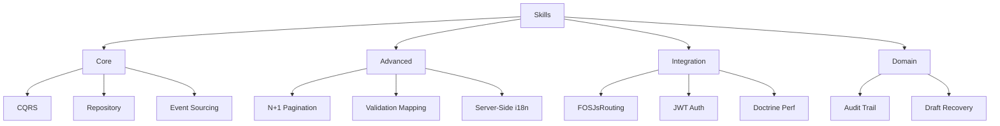

# Skills Library

This directory contains reusable implementation patterns and technical skills that can be referenced by AI agents across multiple LLMs and projects.

## 📁 Structure

```
.skills/
├── core/                    # Fundamental implementation patterns
│   ├── cqrs-pattern-v1.0.md
│   ├── repository-pattern-v1.0.md
│   └── event-sourcing-v1.0.md
│
├── advanced/                # Advanced implementation patterns
│   ├── n-plus-one-pagination-v1.0.md
│   ├── validation-mapping-v1.0.md
│   └── server-side-i18n-v1.0.md
│
├── integration/             # Integration patterns
│   ├── fosjs-routing-v1.0.md
│   ├── jwt-authentication-v1.0.md
│   └── doctrine-performance-v1.0.md
│
└── domain/                  # Domain-specific patterns
    ├── audit-trail-pattern-v1.0.md
    └── draft-recovery-pattern-v1.0.md
```

## 🎯 Purpose

**Skills** are concrete, reusable implementation patterns that define:
- Step-by-step implementation guides
- Code examples and templates
- Configuration patterns
- Performance optimizations
- Integration strategies

## 🔍 Skill Categories

### Core Skills
Fundamental patterns used across many applications:
- **CQRS Pattern**: Command Query Responsibility Segregation implementation
- **Repository Pattern**: Data access abstraction with QueryBuilder
- **Event Sourcing**: Domain event capture and replay patterns

### Advanced Skills
Sophisticated patterns for complex scenarios:
- **N+1 Pagination**: High-performance pagination without COUNT queries
- **Validation Mapping**: React-Symfony error synchronization
- **Server-Side i18n**: Translation catalog injection patterns

### Integration Skills
Patterns for integrating third-party tools:
- **FOSJsRouting**: Expose Symfony routes to JavaScript
- **JWT Authentication**: Token-based auth with LexikJWT
- **Doctrine Performance**: Query optimization and caching strategies

### Domain Skills
Business domain-specific patterns:
- **Audit Trail Pattern**: Compliance-focused change tracking
- **Draft Recovery Pattern**: Network error resilience for forms

## 🚀 How to Use

### 1. Reference in Agents
```yaml
# In agent metadata
dependencies:
  - .skills/core/cqrs-pattern-v1.0.md
  - .skills/advanced/validation-mapping-v1.0.md
```

### 2. Direct Implementation
```bash
# Read skill and implement pattern
cat .skills/core/repository-pattern-v1.0.md

# Via LLM-specific symlink
cat claude-skills/core/repository-pattern-v1.0.md
```

### 3. Copy & Adapt Template
```bash
# Extract code example from skill
grep -A 50 "## Implementation" .skills/core/cqrs-pattern-v1.0.md > my-implementation.php
```

### 4. Programmatic Access
```javascript
// Example: Load skill in Node.js
const fs = require('fs');
const skill = fs.readFileSync('.skills/integration/jwt-authentication-v1.0.md', 'utf8');
// Parse and use...
```

## 📋 File Format

All skill files follow this structure:

```markdown
---
type: skill
category: core|advanced|integration|domain
version: X.Y.Z
status: production|beta|experimental
compatibility:
  llms: [claude, gemini, openai]
  frameworks: [symfony, react, etc.]
dependencies: []
tags: []
created: YYYY-MM-DD
updated: YYYY-MM-DD
author: Team Name
license: MIT
---

# Skill Name

## Overview
[Brief description of the pattern]

## Problem Statement
[What problem does this solve?]

## Solution
[High-level solution approach]

## Implementation

### Prerequisites
[Required dependencies, setup]

### Step-by-Step Guide
1. [Step 1 with code example]
2. [Step 2 with code example]
3. [Step 3 with code example]

### Code Templates
```php
// Full working example
```

## Configuration
[Config files, environment variables]

## Testing
[How to test this pattern]

## Performance Considerations
[Optimization tips, benchmarks]

## Troubleshooting
[Common issues and solutions]

## References
[Related skills, documentation links]
```

## 🔗 Multi-LLM Compatibility

This directory is the **single source of truth** for skill implementations. Symlinks provide compatibility:

| LLM Provider | Symlink Path | Target |
|-------------|-------------|--------|
| Claude | `claude-skills/` | `.skills/` |
| Gemini | `gemini-skills/` | `.skills/` |
| OpenAI | `openai-skills/` | `.skills/` |
| Generic | `skills/` | `.skills/` |

## 📊 Skill Taxonomy



## 🔄 Dependency Matrix

| Skill | Depends On | Used By |
|-------|-----------|---------|
| **CQRS Pattern** | Repository, Event Sourcing | Symfony DDD Agent |
| **Repository Pattern** | - | CQRS, N+1 Pagination |
| **Event Sourcing** | - | Audit Trail, CQRS |
| **N+1 Pagination** | Repository | API Development Agent |
| **Validation Mapping** | - | React TypeScript Agent |
| **Server-Side i18n** | - | React TypeScript Agent |
| **FOSJsRouting** | - | React TypeScript Agent |
| **JWT Authentication** | - | API Development Agent |
| **Doctrine Performance** | Repository | Symfony DDD Agent |
| **Audit Trail** | Event Sourcing | MyPhysio Agent |
| **Draft Recovery** | - | MyPhysio Agent |

## 🆕 Creating New Skills

### 1. Identify Reusable Pattern
Ask yourself:
- Is this pattern used in multiple places?
- Can other projects benefit from this?
- Is it self-contained and documented?

### 2. Choose Category
- **Core**: Framework-agnostic fundamental patterns
- **Advanced**: Complex scenarios requiring expertise
- **Integration**: Third-party library integration
- **Domain**: Business logic patterns (less reusable)

### 3. Write the Skill
```bash
# Create file with naming convention
vim .skills/core/new-pattern-v1.0.md

# Follow the template structure
# Include working code examples
# Add configuration details
# Document edge cases
```

### 4. Add Metadata
```bash
./scripts/add-metadata.sh
```

### 5. Validate
```bash
./scripts/validate-structure.sh
```

### 6. Reference in Agents
Update agent dependencies to reference the new skill.

## 🎓 Best Practices

### When to Create a Skill
✅ **Create a skill when:**
- Pattern is reusable across multiple projects
- Implementation is non-trivial and requires guidance
- Pattern solves a specific, well-defined problem
- You have working code examples to share

❌ **Don't create a skill for:**
- One-off implementations
- Trivial patterns (e.g., "how to create a variable")
- Project-specific business logic
- Patterns without proven benefits

### Writing Quality Skills

**Good skill:**
```markdown
# N+1 Pagination Pattern

## Problem
COUNT(*) queries are slow on large tables (>100K rows).

## Solution
Fetch N+1 records, use the extra record as a "next page exists" indicator.

## Implementation
```php
// Fetch one extra record
$results = $qb->setMaxResults($perPage + 1)->getQuery()->getArrayResult();
$hasMore = count($results) > $perPage;
// Return first N records + hasMore flag
```
```

**Bad skill:**
```markdown
# Making Queries Fast

Just write fast queries. Use indexes.
```

### Versioning
- **Major (X.0.0)**: Breaking changes to implementation
- **Minor (0.X.0)**: New sections, alternative approaches
- **Patch (0.0.X)**: Bug fixes, clarifications, typo fixes

### Naming Conventions
```
{descriptive-name}-v{major}.{minor}.md

Examples:
- cqrs-pattern-v1.0.md
- n-plus-one-pagination-v1.0.md
- jwt-authentication-v1.0.md
```

## 🔧 Extracting Skills from Agents

Use the extraction script to convert sections of agent files into skills:

```bash
# Extract CQRS section from agent into skill
./scripts/extract-skills.sh \
  --agent .agents/core/symfony-ddd-agent-v1.0.md \
  --section "CQRS" \
  --output .skills/core/cqrs-pattern-v1.0.md
```

## 🧪 Testing Skills

### Manual Testing
1. Create a new project or feature branch
2. Follow the skill's implementation guide exactly
3. Verify the code works as documented
4. Document any issues or clarifications needed

### Automated Testing
```bash
# Use skill validation script
./scripts/test-skill.sh .skills/core/repository-pattern-v1.0.md
```

## 📈 Skill Lifecycle

```
Draft → Beta → Production → Deprecated → Archived
  ↓       ↓         ↓            ↓           ↓
 Edit   Test     Use         Migrate      Delete
```

### Status Meanings
- **Experimental**: Being developed, may change significantly
- **Beta**: Working but needs more real-world validation
- **Production**: Stable, tested, recommended for use
- **Deprecated**: Being replaced, avoid in new code
- **Archived**: Moved to archive/, kept for reference only

## 🔄 Updating Skills

### Minor Updates (Safe)
```bash
# Edit skill file
vim .skills/core/repository-pattern-v1.0.md

# Update version in metadata (1.0 → 1.1)
# Add changelog section
# Validate structure
./scripts/validate-structure.sh
```

### Major Updates (Breaking)
```bash
# Copy old version to archive
cp .skills/core/pattern-v1.0.md .skills/archive/pattern-v1.0.md

# Create new version
cp .skills/core/pattern-v1.0.md .skills/core/pattern-v2.0.md

# Edit new version with breaking changes
vim .skills/core/pattern-v2.0.md
```

## 📚 Related Documentation

- **Agents Library**: [.agents/README.md](../.agents/README.md)
- **Project Documentation**: [docs/README.md](../docs/README.md)
- **Master Index**: [docs/index.md](../docs/index.md)

## 🤝 Contributing

1. **Identify** a reusable pattern
2. **Document** with working code examples
3. **Validate** structure and dependencies
4. **Test** implementation in real scenario
5. **Reference** from relevant agents
6. **Commit** with conventional commit message

## 💡 Examples

### Using a Skill in Development
```bash
# Scenario: Implementing pagination

# 1. Find relevant skill
ls .skills/advanced/
# → n-plus-one-pagination-v1.0.md

# 2. Read implementation guide
cat .skills/advanced/n-plus-one-pagination-v1.0.md

# 3. Copy code template
# 4. Adapt to your use case
# 5. Test thoroughly
```

### Referencing in AI Prompt
```
I need to implement JWT authentication in my Symfony API.

Please follow the pattern described in:
.skills/integration/jwt-authentication-v1.0.md
```

## 📞 Support

For questions or issues:
1. Review existing skills in `core/` and `advanced/`
2. Check [docs/index.md](../docs/index.md) for architecture overview
3. Validate structure: `./scripts/validate-structure.sh`
4. Check dependencies: `./scripts/check-dependencies.sh`

---

**Last Updated**: 2026-01-09
**Structure Version**: 1.0.0
**Maintained By**: MyPhysio Team
