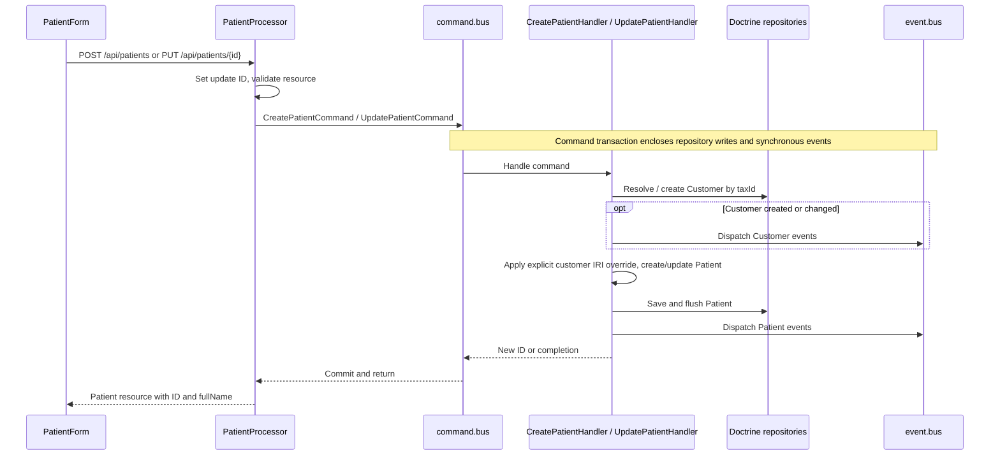
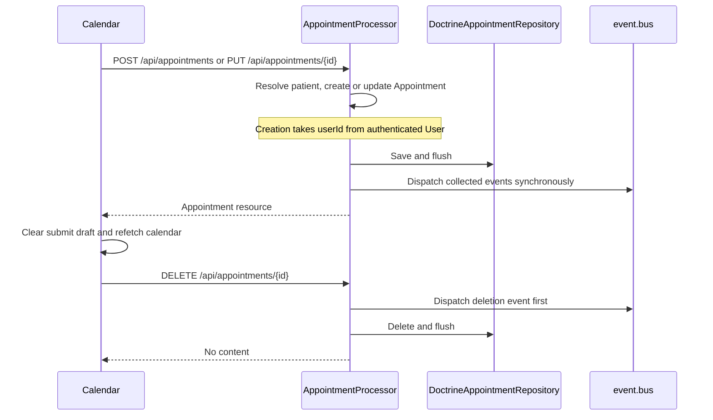
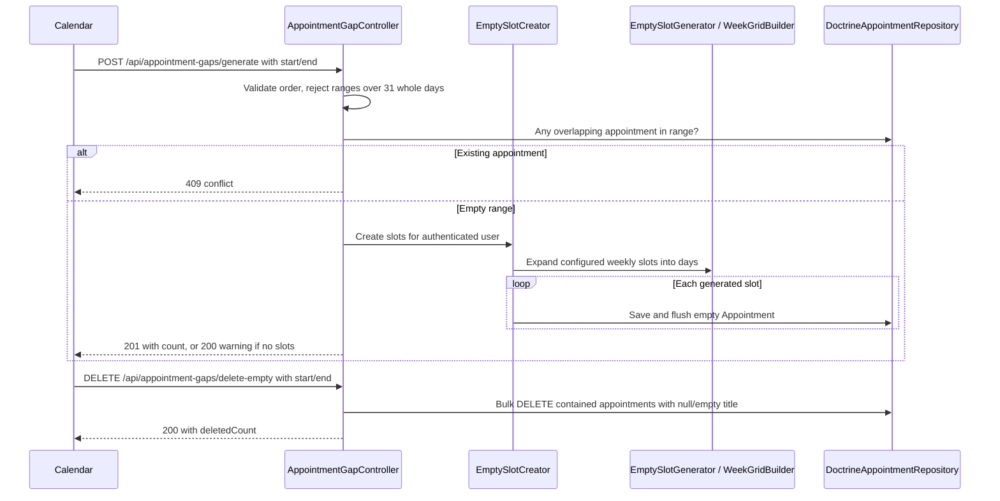
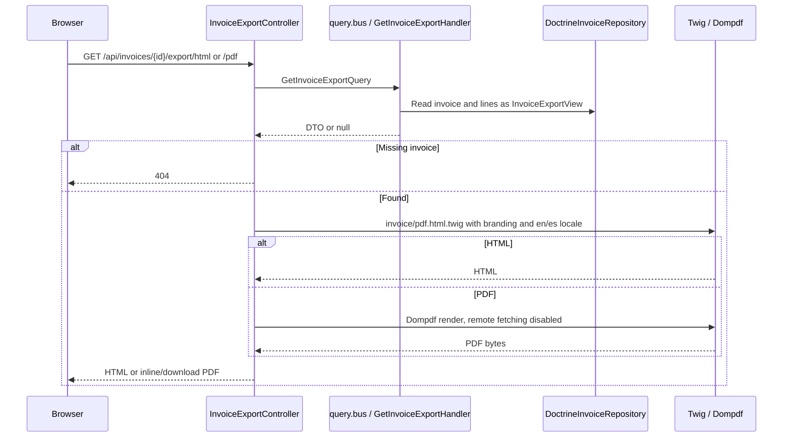
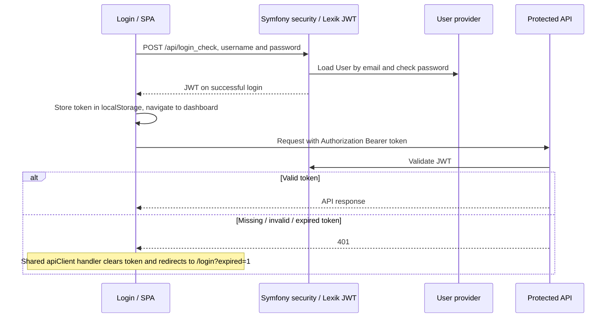
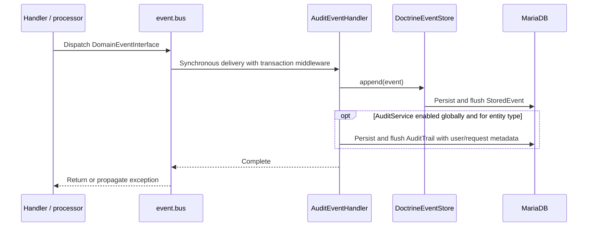

# Critical request flows

Part of the [PCMS System Design](system-architecture.md). Diagrams describe
implemented source paths; authentication is assumed on clinic API requests.
Tests cited below were inspected, not executed. Transaction and audit limitations
are recorded once in [data and consistency](data-consistency.md).

## Patient create and update



Evidence: [processor](../../src/Infrastructure/Api/State/PatientProcessor.php),
[create handler](../../src/Application/Command/Patient/CreatePatientHandler.php),
[update handler](../../src/Application/Command/Patient/UpdatePatientHandler.php),
[form](../../assets/components/PatientForm.tsx).
Creation reuses an existing tax-ID customer; update also changes that customer's
contact/billing fields. This happens before an explicit customer IRI override.
The same customer can therefore affect other linked patients' billing identity.

[PatientResourceTest](../../tests/Functional/PatientResourceTest.php) specifies
creation `201`, unauthenticated creation `401`, and duplicate-email validation
`422`. These tests do not establish rollback under injected event-store failures.

## Appointments and available gaps



The [processor](../../src/Infrastructure/Api/State/AppointmentProcessor.php)
does not dispatch a command. Drag/resize in
[Calendar](../../assets/components/Calendar.tsx) uses PUT and reverts the visual
change on failure. The modal submit flow has draft recovery; drag, resize and
deletion do not save appointment drafts.

[AppointmentProvider](../../src/Infrastructure/Api/State/AppointmentProvider.php)
requires date bounds unless `patientId` is supplied. Its repository selects
appointments contained within those bounds; the separate gap-existence check
tests overlap. Neither query scopes the range to the current user's ID.



Evidence: [gap controller](../../src/Infrastructure/Api/Controller/AppointmentGapController.php),
[creator](../../src/Application/Service/EmptySlotCreator.php),
[generator](../../src/Domain/Service/EmptySlotGenerator.php),
[factory](../../src/Domain/Factory/AppointmentFactory.php),
[repository](../../src/Infrastructure/Persistence/Doctrine/Repository/DoctrineAppointmentRepository.php).
Generation expands whole calendar days, not just intraday request bounds.
Deletion uses **title**, despite the controller comment describing `type = null`.
These batch paths do not dispatch domain events.

Relevant test specifications:
[appointment API](../../tests/Functional/AppointmentResourceTest.php),
[repository](../../tests/Integration/Infrastructure/Persistence/Doctrine/Repository/DoctrineAppointmentRepositoryTest.php),
[network failures](../../tests/e2e/appointments/network/appointments-network.feature).

## Invoice create, update and export

```mermaid
sequenceDiagram
    participant UI as InvoiceForm
    participant Create as InvoiceCreateProcessor
    participant Counter as DoctrineCounterRepository
    participant SQL as Customer / Invoice persistence
    participant Update as InvoiceUpdateProcessor
    participant Events as event.bus
    UI->>Create: POST /api/invoices with recipient and lines
    Create->>Create: Normalize/validate lines and calculate amount
    Create->>Counter: incrementAndGetNext(invoices_YEAR, YEAR000001)
    Counter-->>Create: Number from its own transaction
    Create->>SQL: Resolve/create Customer by taxId
    opt New Customer
        Create->>Events: CustomerCreatedEvent
    end
    Create->>SQL: Persist Invoice and lines through ORM persist processor
    Create->>Events: InvoiceCreatedEvent after persistence
    Create-->>UI: Invoice resource
    UI->>Update: PUT /api/invoices/{id}
    Update->>SQL: Load invoice
    Update->>Update: Normalize and validate input
    Update->>SQL: Read existing numbers for requested year
    Update->>Update: Validate number
    Update->>SQL: Resolve/create Customer, replace lines, save Invoice
    Update->>Events: Events collected by Invoice.update
    Update-->>UI: Invoice resource
```

Evidence: [resource operations](../../src/Infrastructure/Api/Resource/InvoiceResource.php),
[create](../../src/Infrastructure/Api/State/Processor/InvoiceCreateProcessor.php),
[update](../../src/Infrastructure/Api/State/Processor/InvoiceUpdateProcessor.php).
Neither write uses `command.bus`. Update removes old lines and builds new ones;
it does not reconcile lines by ID. Invoice recipient fields are stored on the
invoice, even when it links to a customer. Optional
[patient prefill](../../src/Infrastructure/Api/Controller/InvoicePrefillController.php)
is a read helper, not a patient-to-invoice foreign key.



Evidence: [export controller](../../src/Infrastructure/Api/Controller/InvoiceExportController.php),
[query handler](../../src/Application/Query/Invoice/GetInvoiceExport/GetInvoiceExportHandler.php),
[repository](../../src/Infrastructure/Persistence/Doctrine/Repository/DoctrineInvoiceRepository.php),
[template](../../templates/invoice/pdf.html.twig).
Export is generated synchronously from SQL, not from an archived immutable PDF.
The display prefix does not change the stored invoice number.

Tests read: [number validation](../../tests/Application/Service/InvoiceNumberValidatorTest.php),
[counter allocation](../../tests/Integration/Infrastructure/Persistence/Doctrine/Repository/DoctrineCounterRepositoryTest.php),
[invoice creation/edit loading](../../tests/e2e/invoices/invoices/invoices.feature).
No export rendering or concurrent-numbering result was verified in this review.

## Login and expired authentication



Evidence: [Login](../../assets/components/Login.tsx),
[JWT route](../../config/routes/jwt.yaml), [security](../../config/packages/security.yaml),
[session store](../../assets/presentation/auth/sessionStore.ts),
[HTTP client](../../assets/presentation/api/httpClient.ts),
[bootstrap](../../assets/presentation/bootstrap/frontendBootstrap.ts).
Automatic expiry handling is installed on `apiClient`, not legacy direct Axios
response handling; see [failure behavior](runtime-boundaries.md#failure-behavior).
[Login scenarios](../../tests/e2e/security/login/login.feature) cover success and
invalid credentials, not universal expiry behavior across all screens.

## Event persistence and audit



Evidence: [handler](../../src/Infrastructure/EventHandler/AuditEventHandler.php),
[event store](../../src/Infrastructure/Persistence/EventStore/DoctrineEventStore.php),
[switches](../../src/Infrastructure/Audit/AuditService.php).
Audit reads use [AuditTrailProvider](../../src/Infrastructure/Api/State/AuditTrailProvider.php)
and its entity/operation filters; they do not replay `event_store`.
[AuditTrailCoverageTest](../../tests/Functional/Audit/AuditTrailCoverageTest.php)
checks selected creation audit payloads, not all field changes, IDs or failure paths.
