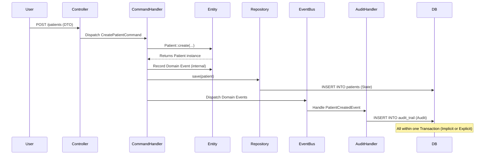

# Pragmatic Event Sourcing (State-Stored Aggregate with Domain Events)

## Overview

This project uses a hybrid architecture pattern that combines the simplicity of **State-Stored Aggregates** (SQL tables as the source of truth) with the power of **Domain Events** for auditing and side effects.

This approach provides 80% of the benefits of Event Sourcing (Audit, Decoupling) with 20% of the complexity (No eventual consistency, no complex versioning).

## Core Concepts

### 1. Source of Truth: SQL Tables
*   Entities (`Patient`, `Appointment`, `Invoice`) are stored in standard Relational Database tables.
*   **Reads** are performed directly against these tables using DTOs or Entities (via Repositories).
*   **Benefits:** ACID transactions, referential integrity (FKs), simple queries, immediate consistency.

### 2. Event Dispatching
*   When an entity changes (Create/Update/Delete), it records a **Domain Event** internally (e.g., `PatientCreatedEvent`).
*   Upon persistence (flush), these events are dispatched synchronously to the `EventBus`.

### 3. Audit Trail (The "Event Store")
*   The `AuditEventHandler` listens to all Domain Events.
*   It persists the event payload into:
    *   `event_store`: Raw event log (immutable history).
    *   `audit_trail`: Structured log for human-readable audit (User X changed Field Y from A to B).
*   **Granularity:** Audit can be enabled/disabled globally or per-entity via environment variables.

### 4. Synchronous Projection (Implicit)
*   Unlike "Pure" Event Sourcing where you write an event and a separate worker updates the read model (asynchronously), here we update the **State** (Read Model) and the **Event Log** in the same transaction.
*   **Result:** Immediate Consistency. The user sees the changes instantly.

## Architectural Flow



## Configuration

### Granular Control
The system allows fine-grained control over which modules generate audit logs via `.env` variables. This is useful for performance tuning or phased rollouts.

```bash
# Global Master Switch
AUDIT_TRAIL_ENABLED=true

# Per-Module Switches
AUDIT_TRAIL_PATIENT_ENABLED=true
AUDIT_TRAIL_CUSTOMER_ENABLED=true
AUDIT_TRAIL_APPOINTMENT_ENABLED=true
AUDIT_TRAIL_INVOICE_ENABLED=true
AUDIT_TRAIL_RECORD_ENABLED=true
```

## Why this approach? (vs Pure Event Sourcing)

| Feature | Pragmatic (Current) | Pure Event Sourcing |
| :--- | :--- | :--- |
| **Source of Truth** | SQL Tables (State) | Event Stream |
| **Complexity** | Low (Standard CRUD + Events) | High (Rehydration, Snapshots) |
| **Consistency** | Immediate (ACID) | Eventual (Write -> Worker -> Read) |
| **Querying** | Standard SQL (`SELECT *`) | Complex (Requires Projections) |
| **Versioning** | Standard DB Migrations | Event Upcasters / Versioning |
| **Audit** | Full History | Full History |
| **Replayability** | Partial (Audit Log) | Full (Can rebuild state) |

## Implementation Details

### Entity
Entities use the `AggregateRoot` trait to handle event recording.

```php
class Patient {
    use AggregateRoot;

    public function update(...): void {
        // 1. Update State
        $this->name = $newName;
        
        // 2. Record Event
        $this->recordEvent(new PatientUpdatedEvent($this->id, ['name' => $newName]));
    }
}
```

### Handler
Handlers are responsible for persisting state and dispatching events.

```php
public function __invoke(CreatePatientCommand $cmd): void {
    // 1. Create State
    $patient = Patient::create(...);
    
    // 2. Persist State
    $this->repository->save($patient);
    
    // 3. Dispatch Side Effects
    foreach ($patient->pullDomainEvents() as $event) {
        $this->eventBus->dispatch($event);
    }
}
```

## Conclusion
This architecture provides a robust, scalable, and auditable foundation for the Physiotherapy management system without incurring the operational overhead of a full Event Sourced system. It is the "Sweet Spot" for this domain.
