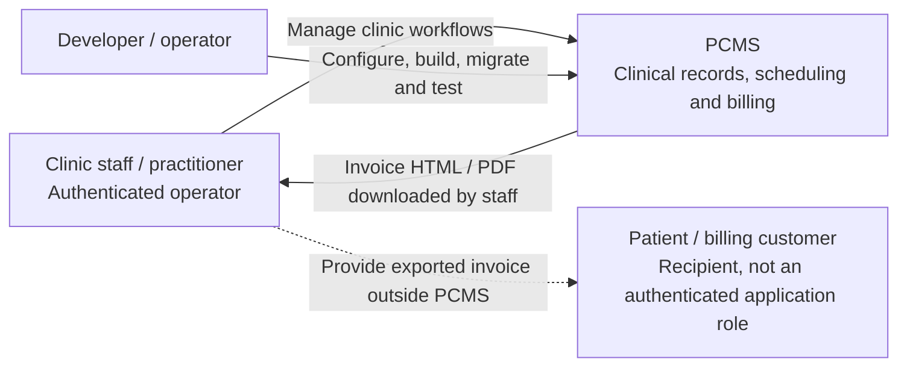
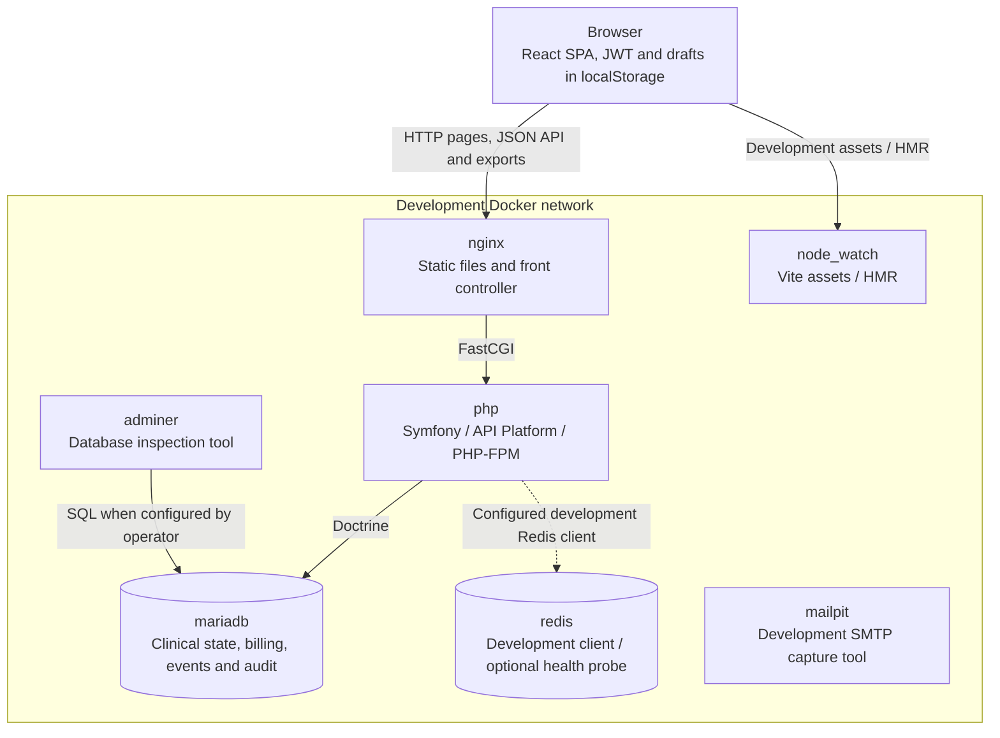

# PCMS System Design

PCMS is a clinic management application: a Symfony JSON API and page shell,
a React SPA, and SQL-backed clinical and billing state. This is the canonical
design entry point; follow the focused views below for implementation details.

## Evidence and navigation

**Source review:** 2026-10-04, application revision `10f0df19d806`.
**Implemented** means visible in source/configuration, with selected tests read
as evidence of intended behavior. It does not mean those tests ran in this review.
**Documented but unverified** identifies operational or historical claims not
demonstrated here. **Proposed** identifies future work, not an existing guarantee.
No production environment files or live services were inspected.

| Question | Canonical view |
| --- | --- |
| How do patient, appointment, invoice, login and audit requests execute? | [Critical flows](critical-flows.md) |
| What is stored, and which writes are atomic? | [Data and consistency](data-consistency.md) |
| Where are trust boundaries, failures and runtime dependencies? | [Runtime and boundaries](runtime-boundaries.md) |
| Where does frontend code belong? | [Frontend map](frontend.md) |
| What do domain events and audit switches mean? | [Domain events](event-driven-strategy.md) |
| How do I configure, build and test? | [Configuration](../operations/configuration.md), [installation](../operations/installation.md), [testing](../testing/e2e.md) |

## Product boundary — C4-style context



- Staff-facing screens cover patients, editable clinical records, calendar slots,
  billing customers, invoices and history; see [the router](../../assets/app.tsx).
- A [Patient](../../src/Domain/Entity/Patient.php) is the clinical subject. A
  [Customer](../../src/Domain/Entity/Customer.php) is a billing identity and may
  be linked to several patients. An invoice stores its own recipient fields.
- [User](../../src/Domain/Entity/User.php) authenticates by email and belongs to an
  `Application`. This relationship alone does not implement tenant isolation;
  see [authorization boundaries](runtime-boundaries.md#authorization-boundaries).
- [Invoice export](../../src/Infrastructure/Api/Controller/InvoiceExportController.php)
  returns a file/HTML response. The reviewed flow does not send it to a patient
  portal, payment provider or external accounting system.

## Containers — implemented development topology

Here “container” means a C4 execution/data unit. The SPA executes in the browser;
the other boxes correspond to services in the development Compose definition.



Evidence: [development Compose](../../docker/dev/docker-compose.yaml),
[watch override](../../docker/dev/docker-compose.override.yaml),
[Nginx](../../docker/dev/nginx/default.conf), [Vite](../../vite.config.js).
MailPit is provisioned tooling, not evidence of a mail-sending clinic workflow.
Redis is not the JWT session store: [sessions are disabled](../../config/packages/framework.yaml)
and [application cache](../../config/packages/cache.yaml) uses filesystem in
dev/test and Doctrine DBAL in prod. The
[test topology](../../docker/test/docker-compose.yaml) has separate SQL/Redis
services and ports but shares the checkout and dependencies; see
[runtime isolation](runtime-boundaries.md#development-and-test-runtime).

## Components and actual request paths

```text
Patient/customer create/update -> resource -> processor -> command.bus -> handler
Appointment/record/invoice write -> API resource -> processor -> entity/persistence
Gap generation/deletion -> controller -> service/repository
Dispatched domain event -> event.bus (sync) -> event storage + optional audit
Read -> provider/controller -> repository -> resource/DTO
Invoice export/dashboard/gap query -> query.bus -> handler -> repository
```

| Component | Responsibility and source |
| --- | --- |
| Domain | [Entities](../../src/Domain/Entity/), [events](../../src/Domain/Event/), [repository contracts](../../src/Domain/Repository/) and calendar domain services |
| Application | [Command handlers](../../src/Application/Command/), [queries](../../src/Application/Query/), DTOs and use-case services |
| API adapters | [Resources, processors, providers and controllers](../../src/Infrastructure/Api/) validate/map HTTP input and orchestrate writes or reads |
| Persistence and side effects | [Doctrine repositories](../../src/Infrastructure/Persistence/Doctrine/Repository/), [event store](../../src/Infrastructure/Persistence/EventStore/DoctrineEventStore.php) and [AuditEventHandler](../../src/Infrastructure/EventHandler/AuditEventHandler.php) |
| Composition | [Service bindings](../../config/services.yaml) select implementations; [Messenger](../../config/packages/messenger.yaml) defines bus-specific middleware |
| Browser | [Screens](../../assets/components/) own UI behavior; [supporting layers](frontend.md) provide HTTP, session, query and draft adapters |

SQL state is authoritative; reads do not replay events. Synchronous events are
in-process side effects, not a queue-backed eventual-consistency pipeline.
Transaction scope depends on the entry path, not just on using Doctrine.

Symfony's [page controller](../../src/Infrastructure/Api/Controller/DefaultController.php)
renders the React shell. [TranslationExtension](../../src/Infrastructure/Twig/TranslationExtension.php)
prepares English/Spanish catalogs, injected by
[Twig](../../templates/default/index.html.twig). Frontend screens mix direct Axios
calls with the shared API client and TanStack Query; do not assume a uniform data layer.

## Decisions and evolution

[ADRs](../adr/) retain decision history. [ADR-009](../adr/0009-pragmatic-event-sourcing.md)
selects SQL state plus synchronous domain events; its “full audit” and consistency
consequences must be read with the [implemented exceptions](data-consistency.md).
Likewise, [ADR-008](../adr/0008-invoice-editing-feature-flag.md) records invoice
editing policy, while the current flag is a browser UI control, not API authorization.

The older [data model](data-model.md), [schema narrative](database-schema.md) and
[original architecture specification](../specifications/04-SYSTEM-ARCHITECTURE.md)
are historical references. Their claims about immutable records, invoice-number
uniqueness, universal auditing, backups or production readiness are not proof of
current behavior. Use the linked source-backed views above when they conflict.

**Proposed:** unify write transaction boundaries and audit completeness, enforce
numbering invariants at the database boundary, and consolidate HTTP error handling.
These are follow-up design topics, not changes implemented by this documentation.
No measured capacity, availability, recovery target or compliance status is asserted.
