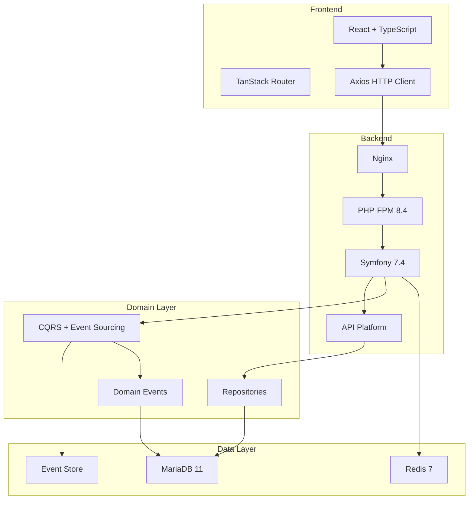
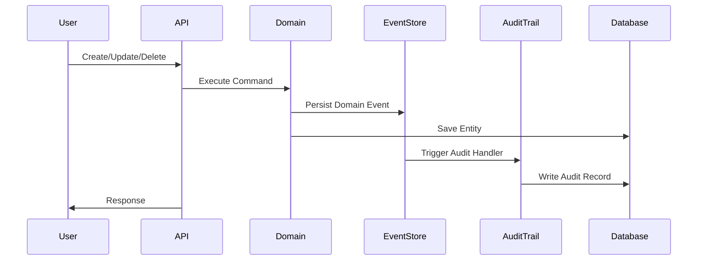
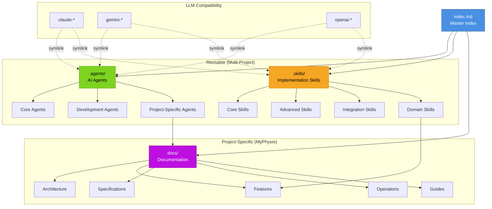
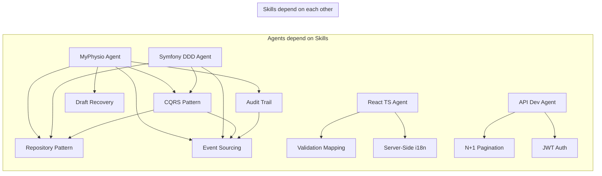

# MyPhysio - Master Documentation Index

> **Central navigation hub** for all project documentation, AI agents, and implementation skills.

## 📖 Table of Contents

- [Quick Start](#-quick-start)
- [Documentation Structure](#-documentation-structure)
- [AI Agents](#-ai-agents)
- [Skills Library](#-skills-library)
- [Project Documentation](#-project-documentation)
- [Architecture & Design](#-architecture--design)
- [Features](#-features)
- [Operations](#-operations)
- [Specifications](#-specifications)
- [Multi-LLM Support](#-multi-llm-support)
- [Navigation Map](#-navigation-map)

---

## 🚀 Quick Start

### For Developers
1. **Setup**: [operations/installation.md](operations/installation.md)
2. **Architecture**: [architecture/system-architecture.md](architecture/system-architecture.md)
3. **Agent Instructions**: [../.agents/project-specific/myphysio-agent-v1.0.md](../.agents/project-specific/myphysio-agent-v1.0.md)

### For AI Assistants
1. **Main Agent**: [../.agents/project-specific/myphysio-agent-v1.0.md](../.agents/project-specific/myphysio-agent-v1.0.md)
2. **Testing Agent**: [../.agents/development/testing-agent-v1.0.md](../.agents/development/testing-agent-v1.0.md)
3. **Skills Library**: [../.skills/README.md](../.skills/README.md)

### For Operations
1. **Installation**: [operations/installation.md](operations/installation.md)
2. **Deployment**: [operations/deployment.md](operations/deployment.md)
3. **Audit System**: [guides/audit-readme.md](guides/audit-readme.md)

---

## 📁 Documentation Structure

```
.
├── .agents/                          # AI Agent Instructions (Reusable)
│   ├── README.md                     # Agents overview
│   ├── core/                         # Core agents (Symfony, React, Git)
│   ├── development/                  # Testing, API development
│   └── project-specific/             # MyPhysio-specific agents
│
├── .skills/                          # Implementation Skills (Reusable)
│   ├── README.md                     # Skills overview
│   ├── core/                         # CQRS, Repository, Event Sourcing
│   ├── advanced/                     # Pagination, Validation, i18n
│   ├── integration/                  # FOSJsRouting, JWT, Doctrine
│   └── domain/                       # Audit Trail, Draft Recovery
│
├── docs/                             # Project Documentation (MyPhysio)
│   ├── README.md                     # Documentation overview
│   ├── index.md                      # THIS FILE - Master index
│   ├── architecture/                 # System architecture & design
│   ├── features/                     # Feature documentation
│   ├── specifications/               # Complete specifications
│   ├── operations/                   # Installation & deployment
│   └── guides/                       # User & developer guides
│
└── [LLM symlinks]                    # Multi-LLM compatibility
    ├── claude-agents → .agents/
    ├── claude-skills → .skills/
    ├── gemini-agents → .agents/
    ├── gemini-skills → .skills/
    ├── openai-agents → .agents/
    └── openai-skills → .skills/
```

---

## 🤖 AI Agents

### Overview
[.agents/README.md](../.agents/README.md) - Complete agent library documentation

### Core Agents (Reusable across projects)

| Agent | Description | Path |
|-------|-------------|------|
| **Symfony DDD Agent** | Domain-Driven Design patterns for Symfony | [.agents/core/symfony-ddd-agent-v1.0.md](../.agents/core/symfony-ddd-agent-v1.0.md) |
| **React TypeScript Agent** | Modern React + TypeScript best practices | [.agents/core/react-typescript-agent-v1.0.md](../.agents/core/react-typescript-agent-v1.0.md) |
| **Git Workflow Agent** | Conventional commits & version control | [.agents/core/git-workflow-agent-v1.0.md](../.agents/core/git-workflow-agent-v1.0.md) |

### Development Agents

| Agent | Description | Path |
|-------|-------------|------|
| **Testing Agent** | Playwright E2E + PHPUnit testing conventions | [.agents/development/testing-agent-v1.0.md](../.agents/development/testing-agent-v1.0.md) |
| **API Development Agent** | RESTful API design with API Platform | [.agents/development/api-development-agent-v1.0.md](../.agents/development/api-development-agent-v1.0.md) |

### Project-Specific Agents

| Agent | Description | Path |
|-------|-------------|------|
| **MyPhysio Agent** | Complete development guide for MyPhysio system | [.agents/project-specific/myphysio-agent-v1.0.md](../.agents/project-specific/myphysio-agent-v1.0.md) |
| **MyPhysio Specifications Agent** | Documentation maintenance & reverse engineering | [.agents/project-specific/myphysio-specifications-agent-v1.0.md](../.agents/project-specific/myphysio-specifications-agent-v1.0.md) |

---

## 🎯 Skills Library

### Overview
[.skills/README.md](../.skills/README.md) - Complete skills library documentation

### Core Skills

| Skill | Description | Path |
|-------|-------------|------|
| **CQRS Pattern** | Command Query Responsibility Segregation | [.skills/core/cqrs-pattern-v1.0.md](../.skills/core/cqrs-pattern-v1.0.md) |
| **Repository Pattern** | Data access abstraction with QueryBuilder | [.skills/core/repository-pattern-v1.0.md](../.skills/core/repository-pattern-v1.0.md) |
| **Event Sourcing** | Domain event capture and replay | [.skills/core/event-sourcing-v1.0.md](../.skills/core/event-sourcing-v1.0.md) |

### Advanced Skills

| Skill | Description | Path |
|-------|-------------|------|
| **N+1 Pagination** | High-performance pagination without COUNT | [.skills/advanced/n-plus-one-pagination-v1.0.md](../.skills/advanced/n-plus-one-pagination-v1.0.md) |
| **Validation Mapping** | React-Symfony error synchronization | [.skills/advanced/validation-mapping-v1.0.md](../.skills/advanced/validation-mapping-v1.0.md) |
| **Server-Side i18n** | Translation catalog injection | [.skills/advanced/server-side-i18n-v1.0.md](../.skills/advanced/server-side-i18n-v1.0.md) |

### Integration Skills

| Skill | Description | Path |
|-------|-------------|------|
| **FOSJsRouting** | Expose Symfony routes to JavaScript | [.skills/integration/fosjs-routing-v1.0.md](../.skills/integration/fosjs-routing-v1.0.md) |
| **JWT Authentication** | Token-based auth with LexikJWT | [.skills/integration/jwt-authentication-v1.0.md](../.skills/integration/jwt-authentication-v1.0.md) |
| **Doctrine Performance** | Query optimization & caching | [.skills/integration/doctrine-performance-v1.0.md](../.skills/integration/doctrine-performance-v1.0.md) |

### Domain Skills

| Skill | Description | Path |
|-------|-------------|------|
| **Audit Trail Pattern** | Compliance-focused change tracking | [.skills/domain/audit-trail-pattern-v1.0.md](../.skills/domain/audit-trail-pattern-v1.0.md) |
| **Draft Recovery Pattern** | Network error resilience for forms | [.skills/domain/draft-recovery-pattern-v1.0.md](../.skills/domain/draft-recovery-pattern-v1.0.md) |

---

## 📚 Project Documentation

### Overview
[docs/README.md](README.md) - Project documentation guide

---

## 🏗️ Architecture & Design

| Document | Description | Path |
|----------|-------------|------|
| **Overview** | High-level system overview | [architecture/overview.md](architecture/overview.md) |
| **System Architecture** | Detailed architecture documentation | [architecture/system-architecture.md](architecture/system-architecture.md) |
| **Data Model** | Entity relationships & domain model | [architecture/data-model.md](architecture/data-model.md) |
| **Database Schema** | Tables, columns, relationships | [architecture/database-schema.md](architecture/database-schema.md) |

### Architecture Diagram



---

## ⚡ Features

| Feature | Description | Documentation | Technical Details |
|---------|-------------|---------------|-------------------|
| **Audit System** | Comprehensive change tracking & compliance | [features/audit-system.md](features/audit-system.md)<br>[guides/audit-readme.md](guides/audit-readme.md) | [specifications/AUDIT_TECHNICAL.md](specifications/AUDIT_TECHNICAL.md) |
| **Draft Recovery** | Network error resilience for forms | [features/draft-system.md](features/draft-system.md) | [specifications/DRAFT_TECHNICAL.md](specifications/DRAFT_TECHNICAL.md) |

### Audit System Overview



---

## 🔧 Operations

| Document | Description | Path |
|----------|-------------|------|
| **Installation** | Local development setup | [operations/installation.md](operations/installation.md) |
| **Deployment** | Production deployment procedures | [operations/deployment.md](operations/deployment.md) |
| **Maintenance** | Ongoing maintenance tasks | [operations/maintenance.md](operations/maintenance.md) |

### Quick Commands

```bash
# Setup development environment
make install

# Start services
make start

# Run tests
make test

# Build frontend
make build

# Deploy to production
make deploy
```

---

## 📋 Specifications

| Specification | Description | Path |
|--------------|-------------|------|
| **00 - Summary** | Executive summary | [specifications/00-SUMMARY.md](specifications/00-SUMMARY.md) |
| **01 - Executive Summary** | Strategic overview | [specifications/01-EXECUTIVE-SUMMARY.md](specifications/01-EXECUTIVE-SUMMARY.md) |
| **02 - Product Requirements** | Functional requirements | [specifications/02-PRODUCT-REQUIREMENTS.md](specifications/02-PRODUCT-REQUIREMENTS.md) |
| **03 - Scope & Roadmap** | Project scope & timeline | [specifications/03-SCOPE-AND-ROADMAP.md](specifications/03-SCOPE-AND-ROADMAP.md) |
| **04 - System Architecture** | Architecture specifications | [specifications/04-SYSTEM-ARCHITECTURE.md](specifications/04-SYSTEM-ARCHITECTURE.md) |
| **05 - Technical Specifications** | Technology stack details | [specifications/05-TECHNICAL-SPECIFICATIONS.md](specifications/05-TECHNICAL-SPECIFICATIONS.md) |
| **06 - Data Model** | Entity & domain model specs | [specifications/06-DATA-MODEL.md](specifications/06-DATA-MODEL.md) |
| **07 - Security & Compliance** | Security policies | [specifications/07-SECURITY-AND-COMPLIANCE.md](specifications/07-SECURITY-AND-COMPLIANCE.md) |
| **08 - Validations & Quality** | Validation rules & QA | [specifications/08-VALIDATIONS-AND-QUALITY.md](specifications/08-VALIDATIONS-AND-QUALITY.md) |
| **09 - Constraints & Limitations** | Known limitations | [specifications/09-CONSTRAINTS-AND-LIMITATIONS.md](specifications/09-CONSTRAINTS-AND-LIMITATIONS.md) |
| **10 - Risks & Mitigation** | Risk assessment | [specifications/10-RISKS-AND-MITIGATION.md](specifications/10-RISKS-AND-MITIGATION.md) |
| **11 - Open Questions** | Pending decisions | [specifications/11-OPEN-QUESTIONS-AND-NEXT-STEPS.md](specifications/11-OPEN-QUESTIONS-AND-NEXT-STEPS.md) |

---

## 🔗 Multi-LLM Support

### Symlink Structure

| LLM Provider | Agents Path | Skills Path |
|-------------|------------|-------------|
| **Claude** | `claude-agents/` → `.agents/` | `claude-skills/` → `.skills/` |
| **Gemini** | `gemini-agents/` → `.agents/` | `gemini-skills/` → `.skills/` |
| **OpenAI** | `openai-agents/` → `.agents/` | `openai-skills/` → `.skills/` |
| **Generic** | `agents/` → `.agents/` | `skills/` → `.skills/` |

### Usage Examples

```bash
# Claude Code
cat claude-agents/project-specific/myphysio-agent-v1.0.md

# Gemini
cat gemini-skills/core/cqrs-pattern-v1.0.md

# OpenAI/ChatGPT
cat openai-agents/development/testing-agent-v1.0.md

# Direct access (all LLMs)
cat .agents/core/symfony-ddd-agent-v1.0.md
```

---

## 🗺️ Navigation Map



---

## 🔄 Dependency Graph



---

## 🛠️ Maintenance & Scripts

### Validation Scripts

```bash
# Validate complete structure
./scripts/validate-structure.sh

# Check symlinks
./scripts/check-symlinks.sh

# Add metadata to files
./scripts/add-metadata.sh

# Extract skills from agents
./scripts/extract-skills.sh
```

### Documentation Scripts

```bash
# Generate table of contents
./scripts/generate-toc.sh docs/index.md

# Check for broken links
./scripts/check-links.sh docs/

# Update all timestamps
./scripts/update-timestamps.sh
```

---

## 📊 Statistics

### Structure Metrics

```bash
# Agents count
find .agents -name "*.md" -not -name "README.md" | wc -l

# Skills count
find .skills -name "*.md" -not -name "README.md" | wc -l

# Documentation count
find docs -name "*.md" | wc -l

# Total documentation size
du -sh docs/ .agents/ .skills/
```

### Current Status

| Category | Count | Status |
|----------|-------|--------|
| Core Agents | 3 | ✅ Production |
| Development Agents | 2 | ✅ Production |
| Project Agents | 2 | ✅ Production |
| Core Skills | 3 | 🔄 To Extract |
| Advanced Skills | 3 | 🔄 To Extract |
| Integration Skills | 3 | 🔄 To Extract |
| Domain Skills | 2 | 🔄 To Extract |
| Documentation Files | 24+ | ✅ Production |
| LLM Symlinks | 6 | ✅ Active |

---

## 🎓 Learning Paths

### For New Developers
1. [operations/installation.md](operations/installation.md) - Set up environment
2. [architecture/system-architecture.md](architecture/system-architecture.md) - Understand architecture
3. [.agents/project-specific/myphysio-agent-v1.0.md](../.agents/project-specific/myphysio-agent-v1.0.md) - Development standards
4. [.agents/development/testing-agent-v1.0.md](../.agents/development/testing-agent-v1.0.md) - Testing practices

### For AI Integration
1. [.agents/README.md](../.agents/README.md) - Agent library overview
2. [.skills/README.md](../.skills/README.md) - Skills taxonomy
3. [.agents/project-specific/myphysio-agent-v1.0.md](../.agents/project-specific/myphysio-agent-v1.0.md) - Project instructions
4. Multi-LLM symlinks - Use provider-specific paths

### For Operations Team
1. [operations/installation.md](operations/installation.md) - Setup procedures
2. [operations/deployment.md](operations/deployment.md) - Deployment guide
3. [specifications/07-SECURITY-AND-COMPLIANCE.md](specifications/07-SECURITY-AND-COMPLIANCE.md) - Security policies
4. [guides/audit-readme.md](guides/audit-readme.md) - Audit system usage

---

## 📞 Support & Contact

- **Documentation Issues**: Review [docs/README.md](README.md)
- **Agent Questions**: Check [.agents/README.md](../.agents/README.md)
- **Skill Patterns**: See [.skills/README.md](../.skills/README.md)
- **Structure Validation**: Run `./scripts/validate-structure.sh`

---

## 📝 Changelog

### 2026-01-09 - Initial Structure
- ✅ Reorganized documentation into `.agents/`, `.skills/`, and `docs/`
- ✅ Created multi-LLM compatibility symlinks
- ✅ Extracted reusable patterns from project-specific docs
- ✅ Added comprehensive README files
- ✅ Created master index (this file)
- 🔄 Skills extraction pending (to be done manually)

---

**Project**: MyPhysio - Physiotherapy Clinic Management System
**Documentation Version**: 1.0.0
**Last Updated**: 2026-01-09
**Maintained By**: MyPhysio Team
